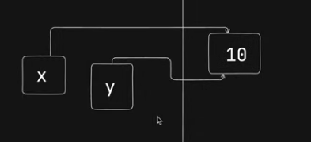
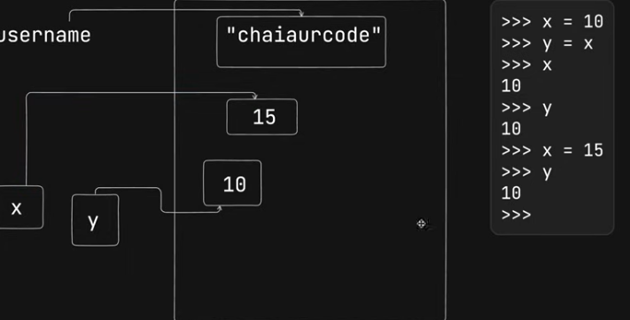

# Meeting Notes

Mutable Objects:

    Lists
    Dictionaries
    Sets
    Byte Arrays

Immutable Objects:

    Integers
    Floats
    Complex numbers
    Strings
    Tuples
    Frozensets
    Bytes

now:
Immutable integers:
x=10
y=x
print(x)#10
print(y)#10
inner working 
x=15
print(x)#15
print(y)#10

## Action Items

1. Complete task A by Friday.
2. Review document XYZ by Monday.

